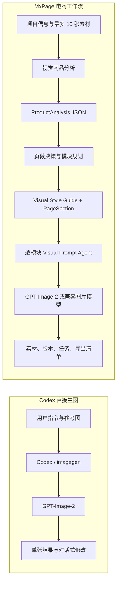

# MxPage 与 Codex 直接调用 GPT-Image-2 的差异与优化梳理

> 核验日期：2026-09-01  
> 对比基线：用户在 Codex 中用自然语言或 `$imagegen` 直接生成/编辑图片，而不是自行编写一套多阶段工作流。

## 1. 结论先行

MxPage 不是一个更强的图片基础模型，也没有在仓库中实现 MCP、Codex Plugin、Codex Skill、模型微调或 RAG。它本质上是一个面向电商详情页的独立 Next.js/Electron 应用，在 GPT-Image-2 或其他兼容图片模型之上增加了一层专用工作流。

它的核心优化来自五部分：

1. 电商领域提示词：把商品识别、卖点、受众、场景、页面结构、视觉一致性、产品物理结构等要求固化为模板。
2. 多阶段模型编排：先商品分析，再页面规划，再为每个页面模块编译图片提示词，最后才调用图片模型。
3. 结构化输出与容错：用 Zod Schema 验证分析和规划结果，失败时尝试文本解析、修复或模板回退。
4. 应用状态与资产管理：保存项目、参考图、分析、页面模块、生成任务、图片版本和导出清单。
5. Provider 工程化：发现模型、推断能力、选择默认模型、尝试候选图片模型、记录调用情况并翻译常见错误。

因此，MxPage 相比 Codex 直接生一张图的优势，不是“图片模型智商更高”，而是把一套电商设计 SOP 产品化、结构化和持久化。Codex 具备通用分析与工具调用能力，也可以通过详细指令、Skill、脚本或 Plugin 复现大部分流程；只是直接调用图片生成时，这些步骤不会自动形成 MxPage 的项目数据、任务状态和版本资产。

## 2. 先澄清 Codex 直接生图是什么

OpenAI 官方文档说明，Codex/ChatGPT 的内置图片生成使用 `gpt-image-2`，可通过自然语言或 `$imagegen` 显式触发，也可以附带参考图进行生成或编辑。官方建议有效提示词描述用途、主体、场景、构图、风格、光线、材质和禁止项。[Codex 图片生成文档](https://learn.chatgpt.com/docs/image-generation)

GPT-Image-2 本身是图片生成与编辑模型，接受文本输入以及图片输入，输出图片，并支持 `/v1/images/generations` 和 `/v1/images/edits`。但它不支持 Structured Outputs、Function Calling 或 Streaming。[GPT-Image-2 模型文档](https://developers.openai.com/api/docs/models/gpt-image-2)

这意味着：

- Codex 直接生图并不是“Codex 文本模型自己输出像素”，而是 Codex 调用图片生成能力。
- MxPage 的商品 JSON、页面规划 JSON 等结构化分析，不可能由 GPT-Image-2 的 Structured Outputs 完成；仓库实际使用的是另外的文本/视觉模型，再把结果交给图片模型。
- Codex 也可以先分析再生图，但是否执行这些步骤取决于用户任务和 Agent 编排；MxPage 则把它们固化为产品流程。

## 3. MxPage 的能力到底来自哪里

| 机制 | 是否使用 | 在 MxPage 中的实际作用 | 结论 |
|---|---:|---|---|
| System Prompt | 是，但较轻 | 多数调用只用 `Return strict JSON only` 一类系统指令约束输出格式 | 不是主要差异来源 |
| 领域 User Prompt / Prompt Template | 是，且是核心 | 固化电商分析、详情页规划、构图、文字、风格、产品一致性和物理约束 | 主要优化来源之一 |
| 独立分析/规划模型 | 是 | 视觉商品分析、页数建议、模块规划、Visual Style Guide、逐图 Prompt 编译 | 主要优化来源之一 |
| Zod Structured Output | 是 | 验证商品分析、页面规划、Visual Prompt Agent 等 JSON 结构 | 提高可用性和可持久化程度 |
| MCP | 否 | 仓库没有 MCP Server/Client、工具定义或 MCP 配置 | 不是 MCP 项目 |
| Codex Plugin | 否 | 没有 `.codex-plugin/plugin.json`、Plugin Manifest 或插件运行时 | 不是 Codex Plugin |
| Codex Skill | 否 | 仓库没有用于 Codex 的 `SKILL.md` 工作流包 | 当前不是 Skill |
| 模型微调 | 未发现 | 没有训练、微调数据或 Fine-tuning 调用 | 优化来自编排，不是训练 |
| RAG / 向量检索 | 未发现 | 没有向量库、Embedding 检索或知识库注入链路 | 不是 RAG 增强 |
| OpenAI-compatible HTTP Adapter | 是 | 调用文本、结构化输出、图片生成和图片编辑端点，并兼容部分 Google/Gemini 路径 | 实际的模型接入层 |
| Prisma 数据模型 | 是 | 保存项目、素材、分析、模块、版本和任务 | 主要产品化增益 |
| 后台任务与监控 | 是 | 批量生成、进度、取消、心跳、过期任务恢复、API 用量日志 | 主要工程化增益 |

OpenAI 官方对 Plugin 的定义是：可安装包可包含 Skill、MCP Server，或两者，并可选 UI；Skill 是包含 `SKILL.md` 的工作流资源，MCP Server 则暴露工具和结构化结果。[OpenAI Plugin 架构文档](https://developers.openai.com/plugins/concepts/plugins) MxPage 的仓库形态不符合这些定义，它是可独立运行的业务应用。

## 4. 两条生成链路对比

在正常成功路径中，若项目需要生成 `N` 张页面图：

- 商品分析约 1 次结构化模型调用；结构化输出失败时还可能追加文本回退和修复调用。
- 页面规划约 1 次结构化模型调用；启用 AI 自动决定主图/详情页数量时再增加 1 次。
- 每张图通常包含 1 次 Visual Prompt Agent 调用和 1 次图片模型调用。
- 因此典型最少约为 `2 + 2N` 次模型调用；启用 AI 自动决定数量时约为 `3 + 2N` 次。Provider 重试、结构修复和编辑会进一步增加调用数。

这不是账单的精确公式：不同 Provider 适配、内部重试和 Codex 内置生图的计费/用量口径并不相同。它只用于说明 MxPage 用更多调用换取结构、稳定性与批量生产能力。

## 5. MxPage 做了哪些具体优化

### 5.1 商品分析从自由文本变成业务对象

`lib/ai/prompts/analysis.ts` 要求分析模型把主图视为商品身份事实源，输出商品名称、类目、材质、颜色、标签、目标人群、使用场景、卖点、差异化、顾虑、视觉重点、补充信息、生成要求和建议页面模块。

`lib/ai/schemas/product-analysis.ts` 用 Zod 固定上述字段；`lib/services/analysis-service.ts` 最多读取 10 张素材，优先 Structured Output，失败时依次尝试普通文本 JSON 解析和修复提示词，并把最终结果保存为 `ProductAnalysis`。

直接生图通常只消费一段当前提示词；MxPage 则先得到后续规划可复用、可编辑、可保存的商品分析对象。

### 5.2 从“生成一张好图”升级为“规划一套详情页”

`lib/ai/prompts/planning.ts` 约束模型：

- 精确生成指定数量的主图和详情图，并保证主图在前。
- 每个模块有不同的商业职责、标题、目标、文案和视觉 Prompt。
- 将用户的生成要求分摊到不同模块，而不是让所有图片表达相同内容。
- 输出全项目共享的 `Visual Style Guide`，统一配色、背景、灯光、镜头、字体、版式、道具、渲染方式和负面约束。
- 对结构、气流、线缆、开口、铰链、重力、阴影等物理关系增加专门约束。

`lib/services/planner-service.ts` 还支持由 AI 决定页面数量；当结构化规划不完整时，会自动切换到模板规划，保证项目仍能继续。

### 5.3 每张图生成前还有一层 Visual Prompt Agent

`lib/services/visual-prompt-agent.ts` 并不直接生成图片，而是先选择一个文本/视觉模型，把模块基础 Prompt 编译成更具体的图片 Prompt。它要求明确：

- 商业目标和目标受众；
- 画布比例、裁切、前中后景、机位和商品位置；
- 灯光、材质、色彩、深度、阴影和反射；
- 图内标题、信息层级、CTA、徽标和安全边距；
- 主商品图的身份锚定；
- 项目级 Visual Style Guide；
- 商品结构、物理规律和 Negative Prompt；
- 生成质量检查清单。

Visual Prompt Agent 最多读取 3 张参考图，90 秒超时；遇到超时、网络、JSON 或 Structured Output 错误时，改用本地确定性模板，而不是让整个生图流程直接中断。

### 5.4 对商品一致性和物理错误做了显式约束

`lib/ai/prompts/generation.ts` 把主商品图定义为商品身份的事实源，要求保持类目、形状、材质、颜色、比例、层级结构、活动部件和可识别细节，只改变场景、构图、视角、裁切、灯光和卖点重点。

它还显式限制线缆消失、反向气流、无支撑悬浮、手穿过实体、液体向上流、阴影断裂、反射不可能、文字穿过商品等问题，并针对吹风机和魔方写了额外规则。

这类优化可以降低常见错误概率，但仍只是 Prompt 约束，不是几何引擎或物理仿真，不能保证图片模型完全遵守。

### 5.5 支持生成、重绘、增强和图内翻译

同一套模块信息可以进入不同编辑模式：

- `regenerate`：保留商品和卖点方向，重做构图与完成度。
- `repaint`：以当前图为底图，重新设计氛围和表现。
- `enhance`：尽量保留构图，提升真实感、纹理、光线、清晰度和边缘质量。
- `translate`：尽量只替换图片中的语言，保留商品、布局、视觉层级和风格。

生成和编辑分别通过 OpenAI-compatible 的 `/images/generations` 与 `/images/edits` 路径执行；有参考图的 GPT Image 生成会优先利用编辑端点。

### 5.6 模型发现、能力推断与候选模型回退

`lib/ai/capability-detector.ts` 和 `lib/ai/model-matcher.ts` 根据模型名称和返回信息推断文本、视觉、结构化输出、图片生成和图片编辑能力，并分别推荐分析、规划、主图、详情图和编辑模型；图片模型优先匹配 `gpt-image-2`。

`lib/services/generation-service.ts` 会构建候选图片模型列表。对可回退错误，按候选顺序继续尝试；若真实图片端点不可用，只有用户显式开启 `allowSvgFallback` 时才生成 SVG 预览。

这里有一个重要边界：模型发现阶段是被动能力推断，不会实际请求图片端点做探测。因此“被识别为支持生图”不等于该 Provider 的真实端点一定可用，最终仍以生成请求结果为准。

### 5.7 把一次性结果变成可管理的项目资产

Prisma 中存在 `Project`、`ProductAsset`、`ProductAnalysis`、`PageSection`、`SectionVersion` 和 `GenerationTask` 等业务实体。配合服务层，MxPage 提供：

- 上传素材和生成素材的本地存储；
- 每个页面模块的当前图片和历史版本；
- 批量生成、进度更新、取消、心跳和过期任务恢复；
- API 调用日志、错误友好化、重试摘要和用量汇总；
- 主图/详情图分类 ZIP 导出和 `export-manifest.json`。

这些属于产品工作台能力，不是图片模型能力，也是它相对一次 Codex 生图最明确的差异。

## 6. MxPage 相比 Codex 直接生图的实际差异

| 维度 | Codex 直接调用 GPT-Image-2 | MxPage | 判断 |
|---|---|---|---|
| 首张图速度 | 指令后直接进入生图 | 先分析、规划、编译 Prompt | Codex 更快 |
| 单张临时需求 | 对话式、自由度高 | 需要创建项目并经过流程 | Codex 更省事 |
| 电商分析 | Codex 能分析，但取决于本次指令 | 固定字段、Schema、持久化 | MxPage 更可重复 |
| 多图页面策略 | 需要用户持续说明或让 Agent 临时规划 | 主图/详情图数量、职责和顺序显式建模 | MxPage 更稳定 |
| 跨图风格一致性 | 依赖会话上下文和用户反复强调 | 项目级 Visual Style Guide 作为统一合同 | MxPage 更可控 |
| 商品身份约束 | 可用参考图和 Prompt 约束 | 主图事实源被重复注入分析、规划和生成阶段 | MxPage 约束更密集 |
| 物理/机械约束 | 用户需要主动写明，Codex也可补充 | 已固化通用规则及少数品类规则 | MxPage 默认更强 |
| 结构化数据 | 默认产物是图片与对话内容 | 分析、模块、版本、任务均为业务数据 | MxPage 明显更强 |
| 批量生产 | 可在对话中要求批量，但不是该仓库式任务台 | 后台批量任务、进度、取消和失败状态 | MxPage 更工程化 |
| 编辑与版本 | 支持对话式编辑和参考图 | 重绘、增强、翻译、版本记录和当前版本切换 | 各有优势 |
| Provider 选择 | 使用 Codex 产品配置的内置能力 | 可配置 OpenAI-compatible Provider 并匹配模型 | MxPage 更开放，但兼容性风险更高 |
| 失败处理 | 由 Codex 产品层处理 | JSON 修复、模板规划、Prompt 本地回退、候选模型回退、可选 SVG | MxPage 处理路径更透明 |
| 调用次数/延迟 | 单张任务链路短 | 每张图前可能额外调用文本/视觉模型 | Codex 更低延迟 |
| 成本可预期性 | 内置生图计入 Codex 用量；API 批量按 API 计费 | 多阶段调用和重试增加成本变量 | MxPage 通常更高 |
| 通用性 | 可跨代码、设计、文件和其他工具工作 | 主要针对电商详情页和小红书图文 | Codex 更通用 |

## 7. “其他 Codex 没有的分析功能”应如何准确理解

严格来说，没有证据表明 MxPage 拥有 Codex 在模型能力上做不到的独家分析。更准确的说法是：它预置了 Codex 直接生图默认不会自动执行和保存的领域流程。

MxPage 额外产品化的分析包括：

1. 商品属性分析：类目、材质、颜色、标签和商品身份。
2. 人群与场景分析：目标用户、使用场景和购买情境。
3. 转化分析：核心卖点、差异化、用户顾虑和展示重点。
4. 页面信息架构：主图/详情模块数量、顺序、职责和文案目标。
5. 视觉系统分析：跨图配色、背景、灯光、镜头、字体、版式、道具和渲染规则。
6. 逐图创意分析：构图、机位、空间层次、商品摆位、图内文字和 Negative Prompt。
7. 商品物理约束分析：线缆、气流、开口、铰链、支撑、重力、阴影与反射。
8. Provider 能力分析：文本、视觉、结构化输出、生图和编辑角色匹配。
9. 运行分析：任务进度、失败原因、API 调用日志、重试摘要和用量统计。

Codex 可以在收到明确要求时完成其中很多分析，也可以利用 Skill/Plugin/MCP 把流程固化。MxPage 的优势是“开箱即用且落入业务对象”，不是“Codex 无法推理”。

## 8. 当前没有实现或不应夸大的能力

### 8.1 没有自动生成后视觉质检闭环

仓库中的 `qualityChecklist` 被拼回图片 Prompt，用来提醒图片模型；没有发现生成完成后再由视觉模型检查成图、打分、定位缺陷并自动重生的闭环。因此不能宣称它已经自动验证文字正确性、商品几何一致性或物理真实性。

### 8.2 Prompt 约束不等于结果保证

图内文字正确、商品结构不变、跨图一致和物理合理都依赖图片模型的遵循能力。即使 Prompt 写得详细，也可能出现错字、变形、零件数量错误或风格漂移。

### 8.3 品类规则存在局部硬编码倾向

当前 Prompt 对吹风机和魔方有专门规则，这对对应商品有效，但对其他品类不会自动获得同等深度的机械知识，也可能对无关任务产生不必要的上下文偏置。长期更合适的方向是按商品类目选择规则包，而不是把品类示例长期放在通用 Prompt 中。

### 8.4 后台任务不是独立的耐久队列

批量工作流由应用进程内后台任务、定时心跳和数据库状态共同管理。应用重启后会把过期任务恢复为失败/停止状态，但没有发现 Redis、BullMQ、RabbitMQ 等独立任务队列。因此它适合本地工作台，不应直接等同于可横向扩容的生产级任务系统。

### 8.5 Provider 兼容层带来不确定性

不同 OpenAI-compatible 服务对模型名、Structured Output、图片编辑 multipart 字段、参考图和尺寸参数的实现可能不同。MxPage 做了路径尝试和错误回退，但不能保证所有兼容服务都与 OpenAI 原生端点行为一致。

### 8.6 本地凭据方案仍需关注前端安全边界

前端从 `localStorage` 读取 API Key/Base URL，再通过 `x-mxpage-*` 请求头传给本地服务层。它避免把 Key 固化在仓库，但也意味着前端 XSS、共享 Windows 账户或被调试的本地会话都可能扩大凭据暴露面；适合个人本地工具，不应直接照搬到多人 SaaS。

## 9. 最终判断与使用建议

适合直接使用 Codex + GPT-Image-2 的情况：

- 只需要一两张临时图；
- 创意方向变化频繁，希望边聊边改；
- 不需要固定的电商字段、页面模块、版本记录和批量导出；
- 更关注速度和灵活性，而不是可重复的生产流程。

适合使用 MxPage 的情况：

- 需要从商品素材连续生成一套电商主图与详情图；
- 需要商品分析、页面规划和跨图风格统一；
- 需要批量任务、进度、取消、历史版本和可交付 ZIP；
- 需要切换第三方 OpenAI-compatible Provider；
- 希望把个人 Prompt 经验固化为团队可重复执行的 SOP。

一句话总结：Codex 直接生图更像“通用创意搭档”，MxPage 更像“把电商策划、视觉规范、Prompt 工程和资产生产串起来的垂直工作台”。

## 10. 仓库证据索引

| 结论 | 主要代码位置 |
|---|---|
| 商品分析 Prompt 与修复 Prompt | `lib/ai/prompts/analysis.ts` |
| 商品分析 Schema | `lib/ai/schemas/product-analysis.ts` |
| 最多 10 张分析图、结构化输出、文本与修复回退 | `lib/services/analysis-service.ts` |
| 页面规划和 Visual Style Guide Prompt | `lib/ai/prompts/planning.ts` |
| 页面规划 Schema | `lib/ai/schemas/section-plan.ts` |
| 自动页数、规划持久化和模板回退 | `lib/services/planner-service.ts` |
| 生图、重生、重绘、增强、翻译 Prompt | `lib/ai/prompts/generation.ts` |
| 逐图 Visual Prompt Agent 与本地 Prompt 回退 | `lib/services/visual-prompt-agent.ts` |
| 图片模型候选、生成/编辑回退、可选 SVG 预览 | `lib/services/generation-service.ts` |
| OpenAI-compatible 文本、图片生成与编辑调用 | `lib/ai/adapters/openai-compatible.ts` |
| 能力推断和默认模型推荐 | `lib/ai/capability-detector.ts`、`lib/ai/model-matcher.ts` |
| Provider 发现与被动端点能力标记 | `lib/services/provider-service.ts` |
| 项目、分析、模块、版本和任务数据模型 | `prisma/schema.prisma` |
| 批量任务、取消、心跳和过期恢复 | `lib/services/workflow-task-service.ts`、`lib/services/task-service.ts` |
| API 用量、错误与重试摘要 | `lib/monitor/api-usage.ts` |
| 本地素材存储和 ZIP/Manifest 导出 | `lib/storage/asset-manager.ts`、`lib/services/export-service.ts` |
| 浏览器端凭据桥接 | `components/layout/provider-credential-fetch-bridge.tsx` |

